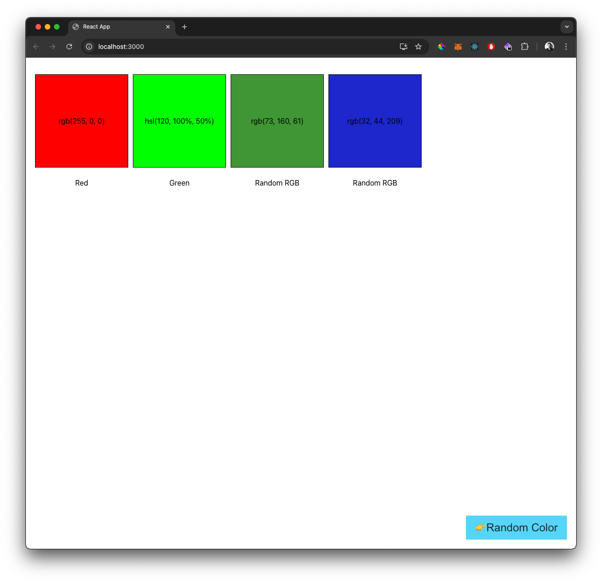

# Kanopi Coding Challenge
  
## Prerequisites

- Docker
- Docker Compose

## Running the project

1. Clone the repository
2. Run `docker-compose up --build`

## Open the project

1. Frontend is available at `http://localhost:3000`
2. Backend API is available at `http://localhost:5001/v1/swatches`

## Backend API

[Backend API Documentation](./backend/README.md)

## Frontend

### Preview

[Frontend Documentation](./frontend/README.md)

## What if I have more time?

- Make sure frontend and backend are typed safe using `ts-json-schema-generator` and `openapi-typescript`
- Add Swagger UI for the API documentation
- Add more test coverage
